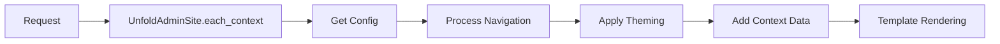

## Overview

Django Unfold is built as a seamless extension of Django's admin framework, preserving full backward compatibility while introducing a modern interface and enhanced features. The architecture follows Django's conventions and design patterns to ensure a smooth integration experience.

<Info>
Unfold extends Django's admin classes through inheritance, meaning you can migrate existing admin configurations with minimal changes to your codebase.
</Info>

## Core Components

Unfold's architecture consists of several key layers that work together to transform the Django admin interface:

<CardGroup cols={2}>
  <Card title="ModelAdmin Layer" icon="layer-group">
    Extended admin classes that inherit from Django's base admin functionality
  </Card>
  <Card title="Widget System" icon="puzzle-piece">
    Custom form widgets that replace Django's default inputs with styled components
  </Card>
  <Card title="Template Layer" icon="file-code">
    Tailwind-based templates that override Django's admin templates
  </Card>
  <Card title="Settings System" icon="gear">
    Centralized configuration for theming, navigation, and customization
  </Card>
</CardGroup>

## Extension Pattern

Unfold follows a mixin-based architecture that separates concerns into specialized components:

```python
class ModelAdmin(
    BaseModelAdminMixin,      # Core form field and widget handling
    ActionModelAdminMixin,     # Custom actions system
    DatasetModelAdminMixin,    # Chart and dataset integration
    BaseModelAdmin             # Django's ModelAdmin
):
    # Unfold-specific attributes
    pass
```

### BaseModelAdminMixin

Handles the core form field and widget replacement logic:

```python
from unfold.admin import ModelAdmin

class MyModelAdmin(ModelAdmin):
    # All form fields automatically use Unfold widgets
    list_display = ['name', 'email', 'created_at']
    search_fields = ['name', 'email']
```

**Key responsibilities:**
- Widget override system
- Form field customization
- Choice field handling
- Foreign key and many-to-many field styling

### ActionModelAdminMixin

Provides enhanced admin actions beyond Django's standard actions:

```python
from unfold.admin import ModelAdmin
from unfold.decorators import action

class ArticleAdmin(ModelAdmin):
    @action(
        description="Export selected items",
        url_path="export",
    )
    def export_action(self, request, queryset):
        # Custom action logic
        pass
```

### DatasetModelAdminMixin

Enables chart and analytics integration in the change form:

```python
from unfold.admin import ModelAdmin
from unfold.datasets import BaseDataset

class SalesDataset(BaseDataset):
    def get_data(self):
        return {
            "labels": ["Jan", "Feb", "Mar"],
            "values": [100, 150, 200]
        }

class SalesAdmin(ModelAdmin):
    change_form_datasets = (SalesDataset,)
```

## Admin Site Integration

Unfold provides its own AdminSite subclass that enhances Django's admin site:

```python
from django.urls import path
from unfold.sites import UnfoldAdminSite

admin_site = UnfoldAdminSite(name="admin")

# In your urls.py
urlpatterns = [
    path("admin/", admin_site.urls),
]
```

### UnfoldAdminSite Features

<Accordion title="Enhanced Navigation System">
  The admin site includes a powerful navigation system with custom sidebar, tabs, and search functionality:
  
  ```python
  # settings.py
  UNFOLD = {
      "SIDEBAR": {
          "show_search": True,
          "command_search": True,
          "navigation": [
              {
                  "title": "Content",
                  "items": [
                      {"title": "Articles", "link": "/admin/blog/article/"},
                  ]
              }
          ]
      }
  }
  ```
</Accordion>

<Accordion title="Theming and Customization">
  Centralized theming through settings configuration:
  
  ```python
  UNFOLD = {
      "COLORS": {
          "primary": {
              "500": "oklch(62.7% .265 303.9)",
          }
      }
  }
  ```
</Accordion>

<Accordion title="Command Palette">
  Built-in search functionality for models and custom content:
  
  ```python
  UNFOLD = {
      "COMMAND": {
          "search_models": True,
          "show_history": True,
      }
  }
  ```
</Accordion>

## Widget System Architecture

Unfold replaces Django's default form widgets with custom implementations that maintain the same API:

```python
# From unfold/overrides.py
FORMFIELD_OVERRIDES = {
    models.CharField: {"widget": widgets.UnfoldAdminTextInputWidget},
    models.DateField: {"widget": widgets.UnfoldAdminSingleDateWidget},
    models.BooleanField: {"widget": widgets.UnfoldBooleanSwitchWidget},
    # ... more field types
}
```

### Widget Inheritance Chain

```python
# Example: Text input widget
class UnfoldAdminTextInputWidget(UnfoldPrefixSuffixMixin, AdminTextInputWidget):
    template_name = "unfold/widgets/text.html"
    
    def __init__(self, attrs=None):
        super().__init__(
            attrs={
                **(attrs or {}),
                "class": " ".join(INPUT_CLASSES),
            }
        )
```

**Widget features:**
- Tailwind CSS class integration
- Dark mode support
- Prefix/suffix icons
- Consistent styling across all input types

<Warning>
While Unfold automatically replaces widgets, you can override them on a per-field basis using `formfield_overrides` in your ModelAdmin.
</Warning>

## Template Override System

Unfold uses Django's template loader to override admin templates:

```
unfold/templates/
├── admin/
│   ├── base.html
│   ├── change_form.html
│   ├── change_list.html
│   └── ...
└── unfold/
    ├── widgets/
    └── helpers/
```

**Template hierarchy:**
1. App-specific templates (if defined)
2. Unfold's templates
3. Django's default admin templates (fallback)

## Settings Configuration System

The settings system uses a merge strategy with sensible defaults:

```python
# From unfold/settings.py
def get_config(settings_name="UNFOLD"):
    def merge_dicts(dict1, dict2):
        result = dict1.copy()
        for key, value in dict2.items():
            if isinstance(result[key], dict) and isinstance(value, dict):
                result[key] = merge_dicts(result[key], value)
            else:
                result[key] = value
        return result
    
    return merge_dicts(CONFIG_DEFAULTS, getattr(settings, settings_name, {}))
```

<Tip>
You only need to define settings that differ from the defaults. Unfold will merge your configuration with the default values.
</Tip>

## Request Context Flow

Unfold enhances the request context to provide additional data to templates:



## Inline Admin Support

Unfold extends Django's inline admin classes:

```python
from unfold.admin import TabularInline, StackedInline

class CommentInline(TabularInline):
    model = Comment
    extra = 1
    per_page = 10  # Unfold-specific: pagination for inlines
    collapsible = True  # Unfold-specific: collapsible inlines

class ArticleAdmin(ModelAdmin):
    inlines = [CommentInline]
```

**Inline features:**
- Pagination support via `per_page`
- Collapsible sections via `collapsible`
- Ordering field support
- Same widget system as main admin

## Extension Points

Unfold provides several hooks for customization:

<Steps>
  <Step title="Custom URLs">
    Add custom views to your ModelAdmin:
    ```python
    class MyAdmin(ModelAdmin):
        custom_urls = (
            ("export/", "export_view", export_view),
        )
    ```
  </Step>
  
  <Step title="Dashboard Callback">
    Customize the dashboard data:
    ```python
    def dashboard_callback(request, context):
        context["custom_data"] = get_custom_data()
        return context
    
    UNFOLD = {
        "DASHBOARD_CALLBACK": "myapp.utils.dashboard_callback"
    }
    ```
  </Step>
  
  <Step title="Template Injection">
    Inject custom templates before/after sections:
    ```python
    class MyAdmin(ModelAdmin):
        change_form_before_template = "myapp/custom_before.html"
        list_after_template = "myapp/custom_after.html"
    ```
  </Step>
</Steps>

## Performance Considerations

<AccordionGroup>
  <Accordion title="Widget Caching">
    Widgets are instantiated once per form and reused. Custom widget logic should avoid expensive operations in `__init__`.
  </Accordion>
  
  <Accordion title="Settings Loading">
    Settings are loaded on each request through `each_context()`. For dynamic settings, use lazy evaluation with callbacks.
  </Accordion>
  
  <Accordion title="Navigation Building">
    Navigation is built per request but can be cached. Consider using callback functions that implement caching for expensive operations.
  </Accordion>
</AccordionGroup>

## Migration from Django Admin

Migrating from standard Django admin requires minimal changes:

<CodeGroup>
```python Before
from django.contrib import admin

class MyModelAdmin(admin.ModelAdmin):
    list_display = ['name', 'created_at']
    
admin.site.register(MyModel, MyModelAdmin)
```

```python After
from unfold.admin import ModelAdmin

class MyModelAdmin(ModelAdmin):
    list_display = ['name', 'created_at']
    # All existing attributes work the same way
    
admin.site.register(MyModel, MyModelAdmin)
```
</CodeGroup>

<Check>
Unfold is designed to be a drop-in replacement. Existing ModelAdmin configurations continue to work without modifications.
</Check>
